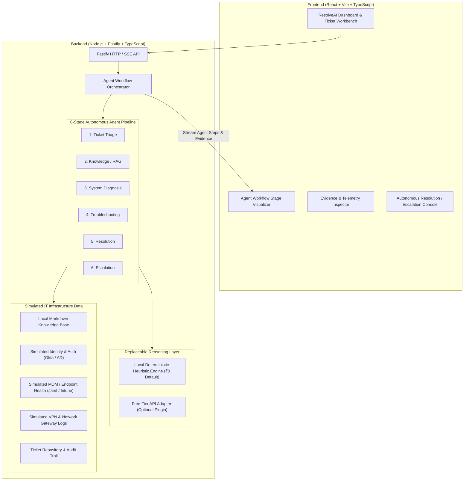

# ResolveAI — System Architecture

## 1. High-Level Architecture Overview

ResolveAI is designed as an observable, zero-cost, autonomous IT Service Desk agent. It follows a lean modular monorepo structure containing a React frontend and a Node.js Fastify backend.

---

## 2. The 6-Stage Autonomous Agent Workflow

Rather than delegating the entire ticket to a single blackbox LLM prompt, ResolveAI orchestrates six explicit stages. Each stage produces verifiable intermediate outputs, evidence citations, and confidence metrics:

### 1. Ticket Triage
- **Input**: Raw employee ticket description, employee email, reported urgency.
- **Output**: Category (Access & Identity, Network/VPN, Software/Apps, Hardware), Priority score (P1-P4), sentiment, and affected service.
- **Evidence**: Extracted keywords, regex pattern matches, intent classification.

### 2. Knowledge / RAG
- **Input**: Ticket category and extracted symptom keywords.
- **Output**: Relevant Knowledge Base (KB) articles, standard operating procedures (SOPs), known error codes, and suggested remediation steps.
- **Evidence**: Article IDs, relevance match score, specific excerpt citations.

### 3. System Diagnosis
- **Input**: Employee identity and affected system.
- **Output**: Correlated system telemetry query results.
- **Simulated Integrations**:
  - *Identity / IdP*: Account lock status, MFA reset status, failed login count, password expiration date.
  - *Device / MDM*: Disk encryption, OS patch level, compliance status, agent daemon health.
  - *Network / VPN*: Gateway connection logs, TLS handshake errors, IP blacklist status.
- **Evidence**: Raw mock JSON logs, timestamps, error codes.

### 4. Troubleshooting & Correlation
- **Input**: KB guidelines + System Telemetry + Ticket symptoms.
- **Output**: Diagnostic hypothesis, root cause analysis (RCA), and confidence rating (0-100%).
- **Evidence**: Chain-of-reasoning showing why specific evidence confirms or disproves hypotheses.

### 5. Resolution
- **Input**: Confirmed root cause and safe SOP.
- **Output**: Automated remediation action execution (e.g., simulated account unlock, session kill, cache clear, self-service guide dispatch).
- **Evidence**: Execution audit log, resolution verification status.

### 6. Escalation (Human-in-the-Loop)
- **Trigger**: Confidence score < 75%, policy-restricted action (e.g., admin credential grant, physical hardware replacement), or automated remediation failure.
- **Output**: Human escalation ticket routed to Level 2 / Level 3 engineering queue with complete diagnostic brief and recommended action.
- **Evidence**: Risk justification and escalation reason.

---

## 3. Replaceable AI Engine Adapter Pattern

To strictly honor the **₹0 budget and portability constraint**:
- **Default Adapter**: `LocalDeterministicAdapter` (TypeScript rule/heuristic/pattern-matching engine that provides 100% offline, deterministic, instant execution with no tokens, no dependencies, no Ollama, and no API keys).
- **Pluggable Adapter**: `GeminiFreeAdapter` or custom LLM adapter that adheres to the interface `AgentReasoningAdapter`. Can be toggled via `AI_PROVIDER` in `.env` without changing any agent pipeline code.

---

## 4. Technology Stack Justification
- **Frontend**: React 18, Vite, TypeScript, Tailwind CSS, Lucide icons.
  - *Why*: Ultra-fast bundle, responsive design, clean visual hierarchy for complex agent workflow trees.
- **Backend**: Node.js 20+, Fastify, TypeScript.
  - *Why*: High performance, low overhead, native TypeScript support, clean JSON schema validation, lightweight footprint.
- **Storage**: In-memory store with seed fixtures and audit logging.
  - *Why*: Zero external database setup needed (PostgreSQL or Redis would add unnecessary friction for a demo), reproducible tests, zero cost.
